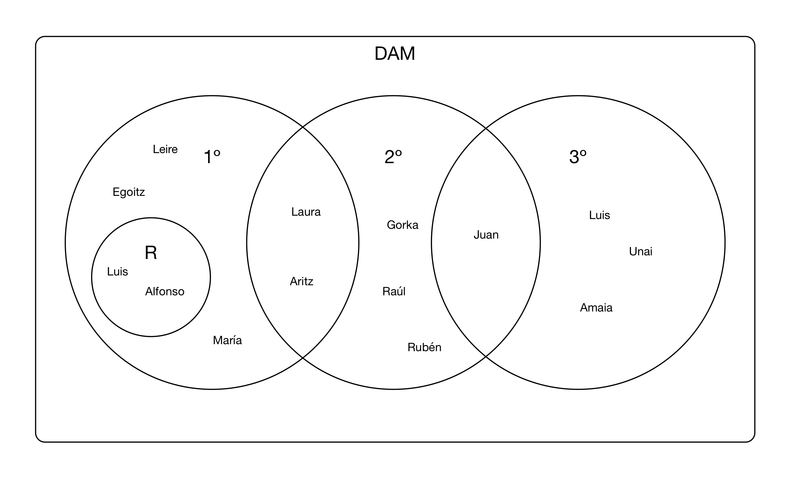

# Alumnos

Disponemos de los siguientes grupos de alumnos:

Utilizándolos como referencia, haz un programa que haga las siguientes tareas:

- Mostrar, por separado, los alumnos matriculados en primero, segundo o tercero.
- Mostrar los alumnos repetidores de primero.
- Mostrar los alumnos que están cursando alguna asignatura de primero por segunda vez.
- Mostrar los alumnos que solo están matriculados en asignaturas de segundo.
- Mostrar los alumnos que estén matriculados en segundo y además tengan algo de primero o de tercero.
- Mostrar todos los alumnos del ciclo.
